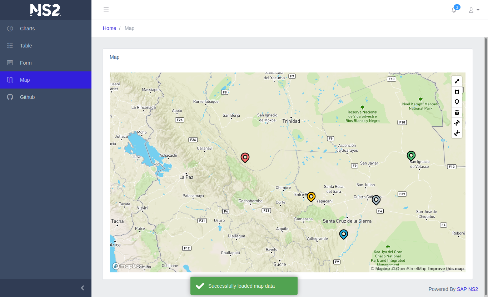
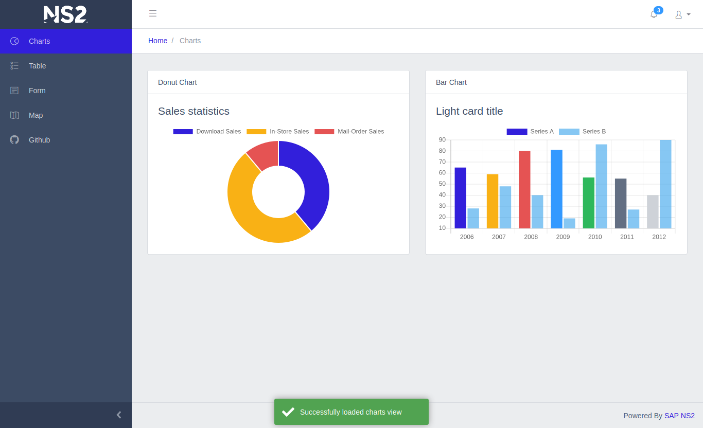

# Frontend Angular

Responsive web seed project for [Angular](https://angular.io/) and [Bootstrap](https://getbootstrap.com/).  This project was generated with [Angular CLI](https://github.com/angular/angular-cli). [CoreUI](https://coreui.io/docs/getting-started/introduction/) and [MapBox](https://www.mapbox.com) are already integrated.  The project is also configured as a [docker](https://docs.docker.com/install/) container

 

  

## Install

* Install dependencies with 
>`npm install`

## Development server

* In one terminal, start a dev build that watches source files and rebuilds automatically

> `npm run watch`

* In a separate terminal prepare the docker nginx development container. You need to do this only *once* for development

>`./docker-build-devh.sh`

* Start the nginx docker container

>`./docker-dev.sh`

The server will be running on [http://localhost:8080](http://localhost:8080)

## Code scaffolding

Run `ng generate component component-name` to generate a new component. You can also use `ng generate directive|pipe|service|class|guard|interface|enum|module`.

## Build

Run `ng build` to build the project. The build artifacts will be stored in the `dist/` directory.

## Run as docker container

Build the image with this script

> `docker-build.sh`

Run the continer with this script

> `docker-run.sh`  

## Further help

To get more help on the Angular CLI use `ng help` or go check out the [Angular CLI README](https://github.com/angular/angular-cli/blob/master/README.md).

To get started with Angular, this is an excellent official [tutorial](https://angular.io/tutorial)

Mapbox component provided by [ngx-mapbox-gl](https://github.com/Wykks/ngx-mapbox-gl)

Dropdown components were created using [ngx-bootstrap](https://github.com/valor-software/ngx-bootstrap)

Chart library by [ng2-charts](https://valor-software.com/ng2-charts/)

Table implementation done with [angular-datatables](https://l-lin.github.io/angular-datatables/#/welcome)

Toast notification done with [ngx-toastr](https://scttcper.github.io/ngx-toastr/)
