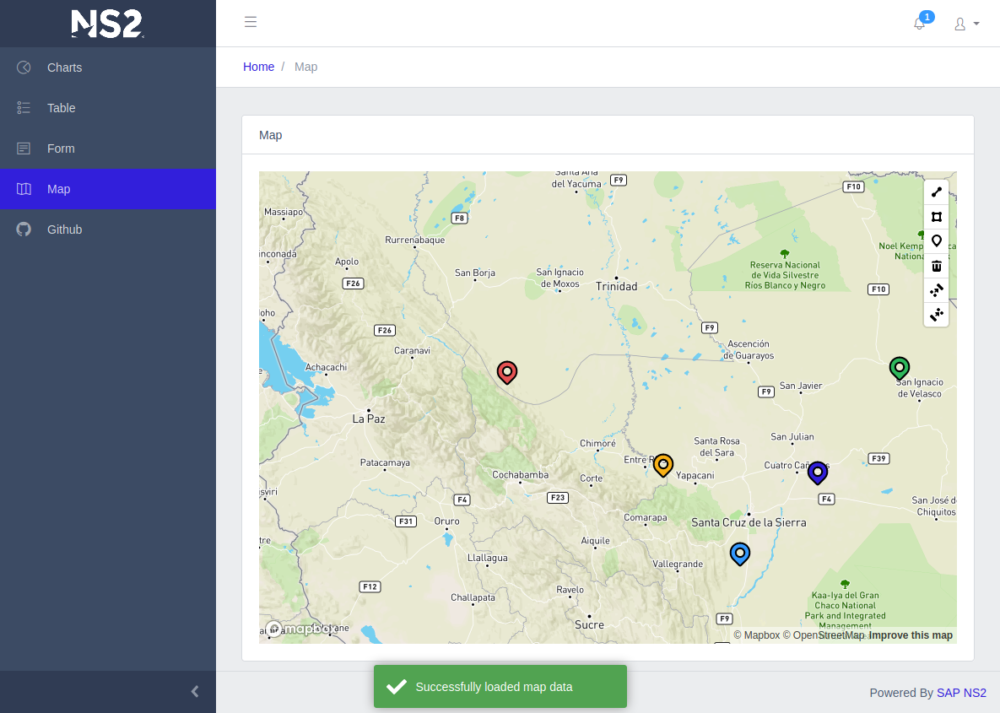
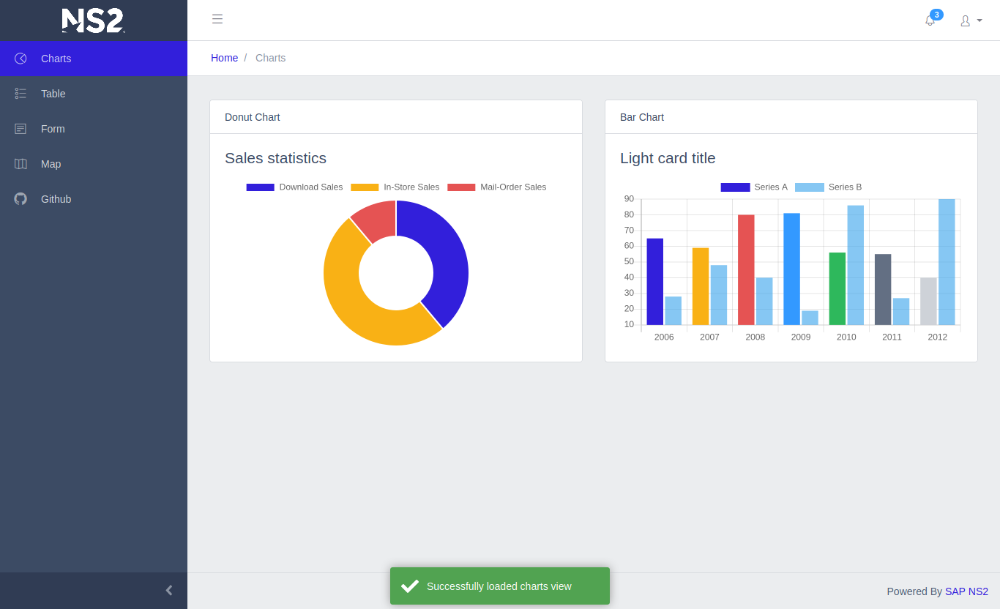
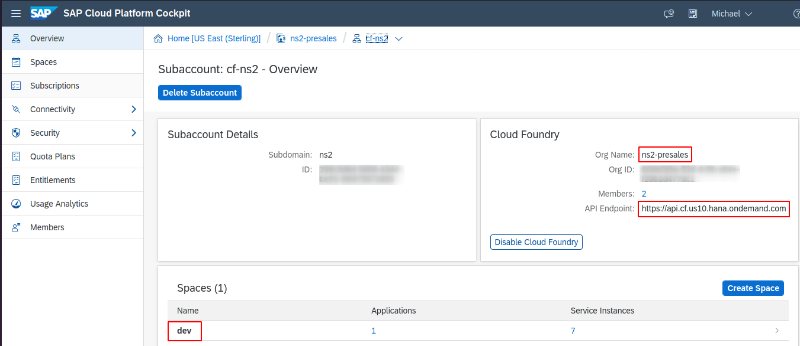

# Nginx Angular

Responsive [Angular](https://angular.io/) and [Bootstrap](https://getbootstrap.com/) web application. This project was generated with [Angular CLI](https://github.com/angular/angular-cli) and is fully compatible. [Keycloak Angular](https://github.com/mauriciovigolo/keycloak-angular) for Single Sign-On, [CoreUI](https://coreui.io/docs/getting-started/introduction/) and [MapBox](https://www.mapbox.com) are already integrated as well as API integration with [JSONPlaceholder](https://jsonplaceholder.typicode.com/). The project is also configured as a [docker](https://docs.docker.com/install/) container that can be deployed on [SAP Cloud Platform](https://www.sap.com/products/cloud-platform.html)





## Run as docker container

>You can create a public registry with security scanning for free at [Quay.io](https://quay.io)

* Build and push the image with this script.
```bash
docker-build.sh
```

* Run the continer with this script
```bash
docker-run.sh
```

## Deploy to SAP Cloud Platform

>You can create an account for free at [SAP Cloud Platform](https://www.sap.com/products/cloud-platform.html)

* Make sure you have the [Cloud Foundry Command Line Interface (cf CLI)](https://docs.cloudfoundry.org/cf-cli/) installed

* Update the `cf-login.sh` script with the values found in the SAP Cloud Foundry Cockpit. Then run the script to login.

```bash
cf-login.sh
```



* Then deploy your container with

```bash
cf-push.sh
```
* You will find a url to your deployed application in the SAP Cloud Foundry Cockpit.


## Local Setup

* Install dependencies with
```bash
npm install
```

## Development

* In one terminal, start a dev build that watches source files and rebuilds automatically

```bash
npm run watch
```

* In a separate terminal prepare the docker nginx development container. You need to do this only *once* for development

```bash
./docker-build-dev.sh
```

* Start the nginx docker container

```bash
./docker-run-dev.sh
```
* The server will be running on [http://localhost](http://localhost)

## Production Build

* Run `ng build` to build the project. The build artifacts will be stored in the `dist/` directory.

## Code scaffolding

* Run `ng generate component component-name` to generate a new component. You can also use `ng generate directive|pipe|service|class|guard|interface|enum|module`.

## Further help

* Learn more about development on SAP Cloud Platform with this [tutorial](https://developers.sap.com/mission.scp-1-start-developing.html)

* [Keycloak](https://www.keycloak.org/) for Open Source application Single Sign-On

* To get more help on the Angular CLI use `ng help` or go check out the [Angular CLI README](https://github.com/angular/angular-cli/blob/master/README.md).

* To get started with Angular, this is an excellent official [tutorial](https://angular.io/tutorial)

* Mapbox component provided by [ngx-mapbox-gl](https://github.com/Wykks/ngx-mapbox-gl)

* Dropdown components were created using [ngx-bootstrap](https://github.com/valor-software/ngx-bootstrap)

* Chart library by [ng2-charts](https://valor-software.com/ng2-charts/)

* Toast notification done with [ngx-toastr](https://github.com/scttcper/ngx-toastr)
