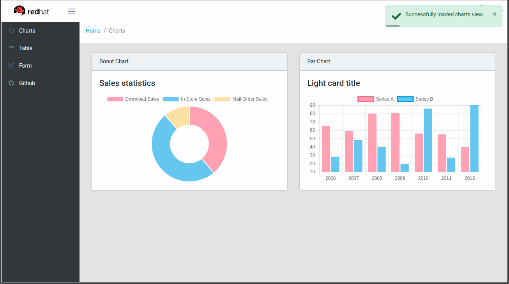

# Frontend Angular

Starter seed project for [Angular](https://angular.io/) and [Bootstrap](https://getbootstrap.com/).  This project was generated with [Angular CLI](https://github.com/angular/angular-cli). [coreui](https://coreui.io/docs/getting-started/introduction/) is already integrated.  The project is also configured to run on [Openshift](https://www.openshift.com/) with no configuration changes necessary.

 

## Install

* Install dependencies with 
>`npm install`

## Development server

* In one terminal, start a dev build that watches source files and rebuilds automatically

> `npm run buildDev`

* In a separate terminal run the express server

>`run-local.sh`

The server will be running on [http://localhost:4200](http://localhost:4200)

## Code scaffolding

Run `ng generate component component-name` to generate a new component. You can also use `ng generate directive|pipe|service|class|guard|interface|enum|module`.

## Build

Run `ng build` to build the project. The build artifacts will be stored in the `dist/` directory.

## Running on OpenShift
Requires an accessible [OpenShift Container Platform](https://www.openshift.com/container-platform/index.html) install

For local development you can use [MiniShift](https://docs.openshift.org/latest/minishift/getting-started/installing.html)

### Create the New Application

Select `Add to Project -> Catalog -> JavaScript -> Node.js`
* Name **frontend-angular**
* Git Repository URL **https://github.com/mechevarria/frontend-angular**
* Click create

The default build will run a `npm install, npm build` command and then `npm run start`.
  
## Further help

To get more help on the Angular CLI use `ng help` or go check out the [Angular CLI README](https://github.com/angular/angular-cli/blob/master/README.md).

To get started with Angular, this is an excellent official [tutorial](https://angular.io/tutorial)

Dropdown components were created using [ngx-bootstrap](https://github.com/valor-software/ngx-bootstrap)

Chart library by [ng2-charts](https://valor-software.com/ng2-charts/)

Table implementation done with [angular-datatables](https://l-lin.github.io/angular-datatables/#/welcome)

Toast notification done with [ngx-toastr](https://scttcper.github.io/ngx-toastr/)
